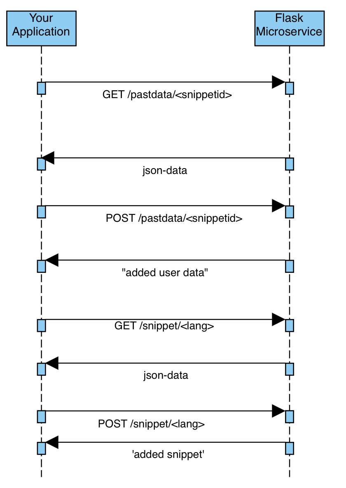

## Microservice Description: ##

How to Request Data from pastdata ENDPOINT: GET request sent to http://localhost:5123/pastdata/<snippetid>
will return a JSON file containing random selection from a defaultdict python object used to store this data

How to Send Data to pastdata ENDPOINT: POST request sent to http://localhost:5123/pastdata/<snippetid>
with JSON as body. Ensure headers set to "Content-type: application/json and response will be
"added user data". This will add the json to the defaultdict python object used to store this data

How to Request Data from snippet ENDPOINT: GET request sent to http://localhost:5123/snippet/<lang>
will return a JSON file containing random selection from a defaultdict python object used to store this data

How to Send Data to snippet ENDPOINT: POST request sent to http://localhost:5123/snippet/<lang>
with JSON as body. Ensure headers set to "Content-type: application/json and response will be
"added user data". This will add the json to the defaultdict python object used to store this data

## UML Diagram: ##
  

